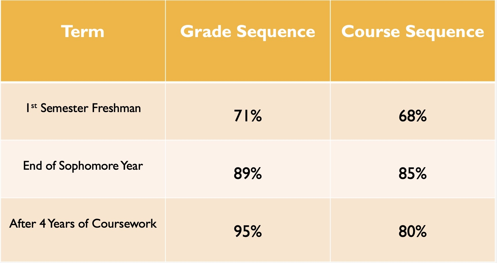

# BSC Student Success Analysis
 
---
## Authors:
Pete VanZandt, CeCe Lacey, Dorothy Alexander
---

## Overview
This project focused on creating a model that could determine how impactful a student's freshman year is at Birmingham-Southern College (BSC) and how it affects their probabilty of finishing and also graduating at BSC. The project used data provided by the school from year 2014 to current. We focused on 2014-2018 so we could track the students from freshmen year to their expected graduation date in 2018. This model could be useful for Birmingham-Southern College to increase the number of students staying and graduating at the institution.

---

## Business Problem
We want to be able to give BSC insight on their student’s success rate on campus. Success rate is measured by if the student essentially graduates from Birmingham-Southern College. This project used Neural Networks and Random Forest Classifier to look at if the student actually did graduate, what grades did they get during their freshmen year and how accurate is the system in determining the likelyhood the student will stay all four years and will also end up graduating. Ultimately the goal of the model is to serve as an early indicator for 1st year students to give them guidance on how much their 1st semester's performance impacts their likelihood of completing a degree at Birmingham-Southern College.

---

## Data 
The project used the Birmingham-Southern College dataset which included 34 columns. We looked at Graduation as the target with the output either being a yes or no and the features being the student's id, the class name, the grade received from the class taken, the cohort and which term the specific student took the course.

---

## Methods
This project utilized exploratory data analysis, feature engineering, decision tree classification models, random forest classification models, hyperparameter tuning, and machine learning with neural networks. The random forest classification model outpreformed the decision tree classifcation. **NEED TO ADD MORE INFO**

---

## Results

The most prominent feature we looked at was the grades that the student received from the first semester of freshman year that then impacted on the success rate with the student in fact completeting BSC and graduating


The graph above shows the cohorts (each student class) in each fall term of the years 2014 all the way to 2017. Each year was separated by the students in each cohort who have graduated. In each cohort more students graduate rather than not graduating. It also looks as though there is a gradual increase over these years of number of student's graduating. 

---


The above visualization shows that yes, indeed the fall gpa has the obvious highest importance with the Random Forest Model. Fall gpa has the most influence on the rate of graduation which is the target variable. 

---


The above chart shows the three terms that were looked at through the neural network squential model. The percentage is measuring accuracy within each column and term. The three terms are 1st Semester Freshman year, end of sophomore year, and after the 4 years of coursework being the end of your time at BSC. The Grade sequence column is modeling what grades the students make and the course sequence is looking at the course load the students are taking.

---

## Conclusions
* Grade sequences are better than class sequences for predicting the success rate of an individual student graduating at Birmingham-Southern College. In the neural network sequential model, the grade sequence had a better accuracy outcome and the course sequence accuracy output was consistently worse in percentage. 

---

## Next Steps
* Look into the time period from freshman year to sophomore year to see how many students leave ending their freshman year and before starting their sophomore year. 
* Focus on just the freshmen and look at trends of professors, classes, living situations, athletics and essentially looking at more trends of freshmen year and the impacts at a micro level to see how those variables impact in the bigger picture of students graduating

---

## For More Information

## NEED TO FILL IN THE LINKS BELOW ##
Please review the full analysis via [Jupyter Notebook](./notebooks/final_notebook.ipynb) or [Powerpoint](./Chocolate_Rating_Analysis.pdf).

For any additional questions, please contact Pete VanZandt & pvanzand@bsc.edu, CeCe Lacey & cecelacey@gmail.com, Dorothy Alexander & dcalexan@bsc.edu

---
## Repository Structure
```
├── README.md                               
├── final_notebook.ipynb                    
├── presentation_BSC_student_success.pdf     
├── data                                    
│   ├── EDA.csv
│   └── anonymized_bsc_dataPVZ.csv
├── notebooks 
│   ├──exploratory
│   └── final_notebook.ipynb
└── images
    ├──logo.jpg
    ├──RF_feature_import.jpg 
    ├──conf_mat_RF_train.jpg
    ├──graduation_rates.jpg
    ├──rnn_sequential_model_accuracy.jpg
    └──...
